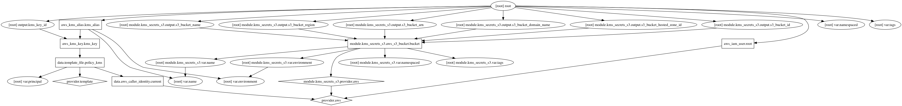

AWS KMS Terraform Module
=====================

Create AWS KMS Key and set policy

Usage:
------

    module "kms" {
      source      = "../tf_kms"

      add variables
    }

## Inputs

| Name | Description | Default | Required |
|------|-------------|:-----:|:-----:|
| environment | Environment (ex: dev, qa, stage, prod) | - | yes |
| name | Name | - | yes |
| namespaced | Namespace all resources (prefixed with the environment)? | `true` | no |
| principal | principal | - | yes |
| tags | A map of tags to add to all resources | `<map>` | no |

## Outputs

| Name | Description |
|------|-------------|
| kms_key_id | AWS KMS Key ID |

### Resource Graph

